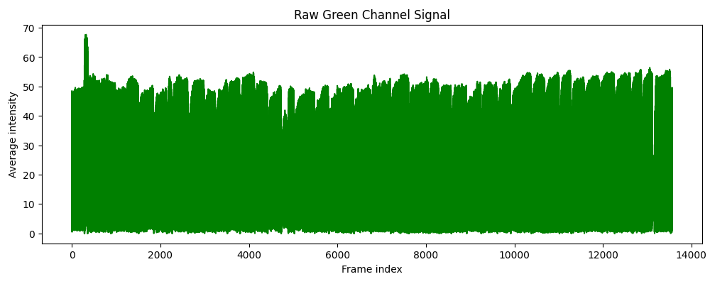
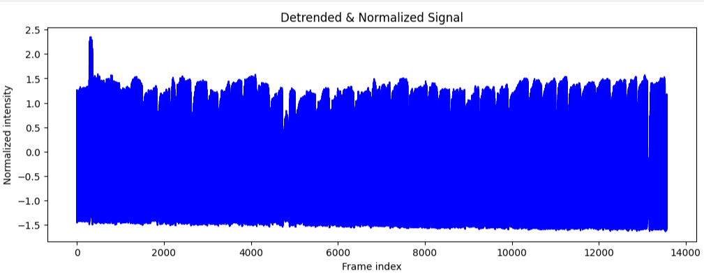
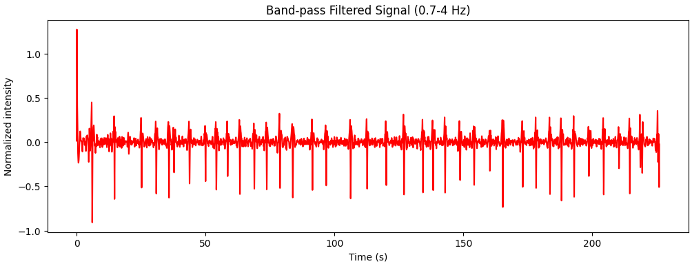
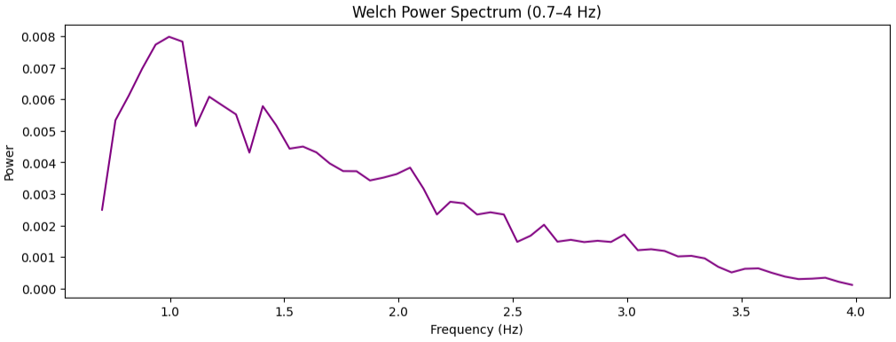

# Remote PPG-Based Heart Rate Estimation from Binary ROI Signals

This repository demonstrates a pipeline for estimating heart rate from binary signals extracted from facial regions (forehead and sclera) of a single patient. There are two corresponding binary files (forehead and sclera). The binary files contain only numerical intensity values and cannot be reconstructed into images, ensuring full privacy.

Even though the signals come from the same patient, forehead and sclera ROIs can produce slightly different BPM estimates. This is natural due to varying skin thickness, vascularization, lighting, and region-specific motion artifacts.

---

## Pipeline Overview

The workflow involves several signal processing steps to extract the heart rate from ROI intensity signals. Each step is explained below with the corresponding signal visualization.

### 1. Raw Signal Extraction
A 1D signal is obtained by averaging pixel intensities across frames of the selected ROI. This temporal signal contains subtle pulsatile components corresponding to the cardiac cycle.



### 2. Detrending
Removes slow baseline variations caused by lighting changes or subtle motion. This isolates the pulsatile fluctuations from slow drifts.

### 3. Normalization
Scales the signal to zero mean and unit variance. This step standardizes amplitude across ROIs, making signals comparable.



### 4. Band-pass Filtering
A Butterworth band-pass filter isolates the cardiac frequency range (0.7–4 Hz, ~42–240 BPM), enhancing the heart-rate component while suppressing low-frequency drift and high-frequency noise.



### 5. Power Spectrum & BPM Estimation
Welch’s method computes a smooth power spectral density (PSD) of the filtered signal. The dominant frequency peak in the PSD corresponds to the estimated heart rate (BPM).



---

## Notes & Limitations

- The **green channel** is used because hemoglobin absorbs green light most strongly, producing the clearest rPPG signal.  
- Differences between forehead and sclera BPM for the same patient are expected due to physiological and measurement variations.  
- Ground truth heart rate data was not available, so BPM estimates cannot be verified against a reference.  
- Only one patient’s data is included due to large file sizes. This limits generalizability but is sufficient to demonstrate the pipeline.
- This repository demonstrates a **proof-of-concept** pipeline. The signals are not optimized for accurate heart rate measurement.  
- Low-quality or noisy signals are expected, and discrepancies between ROI-derived BPM values are normal.  
- All binary data is **non-identifiable** and safe to share publicly.  
- Intended for **educational and experimental purposes**, demonstrating a full rPPG signal processing pipeline.

---

## Final Note

This project represents a small step within a larger research idea. The approach can be extended to other applications that involve extracting features from videos using signal processing. In such a pipeline, specific facial regions can be cropped using computer vision, and signal processing can be applied to extract features such as dominant frequencies or heart rate. These features can then be used as input for machine learning or deep learning models to predict various physiological parameters.

For privacy reasons, the vision component is not included in this repository; only the preprocessed signal data is provided. The goal of this project is **feature extraction**, not precise heart rate measurement. Consequently, obtaining highly accurate BPM values was not necessary — the emphasis is on generating informative features for downstream modeling.

---

## Usage

1. Install dependencies:

```bash
pip install -r requirements.txt
